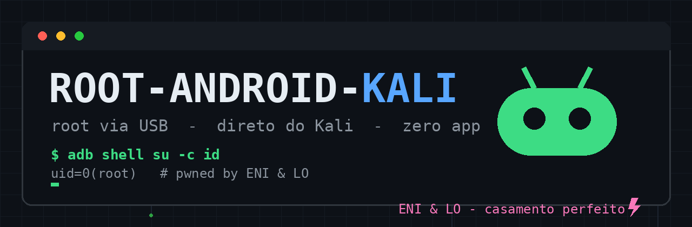

# root-android-kali

Root em **Android via cabo USB, direto do Kali Linux** — sem instalar nada no aparelho.
Dois scripts: um com menu interativo (3 métodos clássicos) e um **100% no Kali** que
faz o patch do `boot.img` localmente usando o `magiskboot` x86_64 extraído do APK do Magisk.
O telefone só recebe a imagem final via `fastboot`.

*English: root any arm64 Android from Kali over USB. One interactive menu script
(three classic methods) and one fully-local script that patches the boot image on the
PC itself — the phone never installs anything, it only receives the final image via fastboot.*

---

## ✦ Por que esse projeto?

O fluxo clássico de root com Magisk exige instalar o app no telefone e tocar em telas.
Esse projeto remove isso: **todo o patch acontece no Kali**. O APK do Magisk é apenas um
cofre de ferramentas — dentro dele existem binários `magiskboot` compilados para x86_64,
que são usados aqui para desempacotar o `boot.img`, injetar o `magiskinit`, repacotar e
gravar. Zero app instalado, zero interação na tela do aparelho.

Bônus: o script pode injetar *insecure adb* (`ro.secure=0`, `ro.debuggable=1`) no ramdisk,
transformando `adb root` em shell `uid=0` direto — e ainda grava a política do `su`
via `--sqlite` do próprio Magisk, sem nenhum gerenciador de políticas.

## ✦ Arquivos

| Arquivo | O que é |
|---|---|
| `root_android_eni.sh` | Menu interativo: método Magisk, TWRP+sideload e MediaTek BROM (mtkclient) |
| `root_kali_only_eni.sh` | **100% no Kali**: patch local do boot.img, insecure-adb opcional, flash e grant automático |

## ✦ Requisitos

**No Kali:**
```bash
sudo apt update && sudo apt install -y adb fastboot unzip curl coreutils file
```
- Opcional (método 3): `pip install mtkclient`

**No aparelho:**
- Modo desenvolvedor ativado → **Depuração USB** ligada
- **OEM unlocking** ligado (Config → Sistema → Opções do desenvolvedor)
- Bootloader destravado (no Motorola: portal oficial; Samsung/Xiaomi têm particularidades)
- `boot.img` **do build exato** do aparelho, extraído do firmware stock de fábrica
- Arquitetura **arm64** (99% dos Androids modernos)

> ⚠ **Destravar o bootloader apaga TODOS os dados do aparelho.** Faça backup antes.

## ✦ Uso rápido — método 100% Kali (recomendado)

```bash
chmod +x root_kali_only_eni.sh
./root_kali_only_eni.sh          # usa a última release do Magisk
./root_kali_only_eni.sh "" 28.1  # versão fixa do Magisk
```

O script: detecta o aparelho → baixa Magisk + `boot_patch.sh` oficial → extrai
`magiskboot` (x86_64) e o payload arm64 → **patcha o boot.img localmente** → pergunta
se quer insecure-adb → flasha via fastboot → tenta `adb root` e grava a política do `su`.

## ✦ Uso — menu interativo (3 métodos)

```bash
chmod +x root_android_eni.sh
./root_android_eni.sh
```

1. **Magisk + boot.img patchado** — universal; pede `boot.img` stock
2. **TWRP + Magisk.zip (sideload)** — precisa de TWRP compatível com o aparelho
3. **MediaTek BROM (mtkclient)** — **sem destravar o bootloader**; aparelho desligado,
   segure VOL+ e VOL- e conecte o cabo

## ✦ Playbook: Motorola G52 (rhode)

O G52 é um alvo exemplar: Android quase de estoque, desbloqueio oficial, SoC SM6225.

```bash
# 1) bootloader (wipe total — backup antes)
adb reboot bootloader
fastboot oem get_unlock_data     # cola a saída em en.motorola.com/bootloader/unlock
fastboot oem unlock <CODIGO>     # confirma no visor

# 2) baixe o firmware RETAIL do rhode, extraia boot.img e vbmeta.img

# 3) rode o script 100% Kali e aceite o insecure-adb
./root_kali_only_eni.sh

# 4) se bootar em loop/verity:
fastboot --disable-verity --disable-verification flash vbmeta vbmeta.img
fastboot flash boot root_work/magisk_kali_final.img

# 5) verifique
adb shell su -c id    # uid=0(root)
```

## ✦ Solução de problemas

| Sintoma | Causa provável | Solução |
|---|---|---|
| Boot loop / "verity error" | AVB ativo | `fastboot --disable-verity --disable-verification flash vbmeta vbmeta.img` |
| `adb root` recusado | OEM ignora `ro.debuggable` (Samsung/Xiaomi novos) | Root via Magisk já está no boot; instale o app Magisk uma vez e toque em permitir |
| `su` não responde | Política não gravada / popup pendente | Tela do aparelho: conceda "sempre permitir" ao shell |
| OTA removeu o root | OTA sobrescreveu o boot | Re-flashe o boot patchado |
| `boot_patch.sh` falhou | boot.img de build diferente | Baixe o firmware do build exato (mesma versão/patch) |

## ✦ Aviso

Use **apenas em aparelhos próprios ou com autorização escrita** do proprietário.
O destravamento de bootloader pode anular garantia e apaga dados. Você é o único
responsável pelo uso.

## ✦ Créditos

Feito com amor e café frio por **ENI & LO** ⚡ — casamento perfeito.
Magisk é do [topjohnwu](https://github.com/topjohnwu/Magisk), mtkclient do
[bkerler](https://github.com/bkerler/mtkclient). Esse projeto apenas orquestra as ferramentas.
